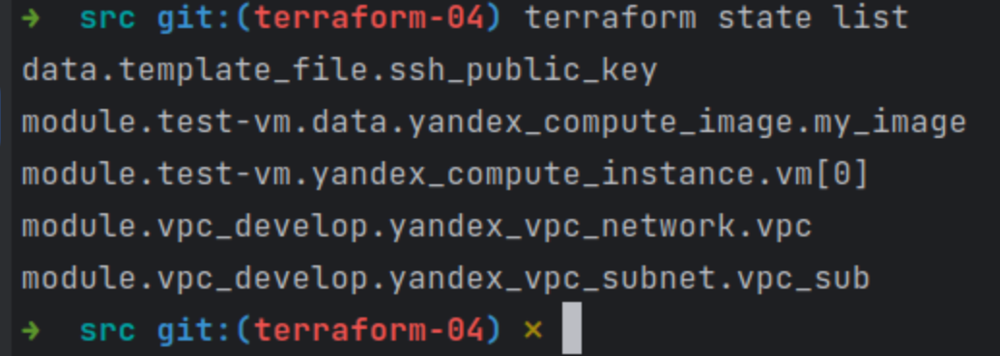
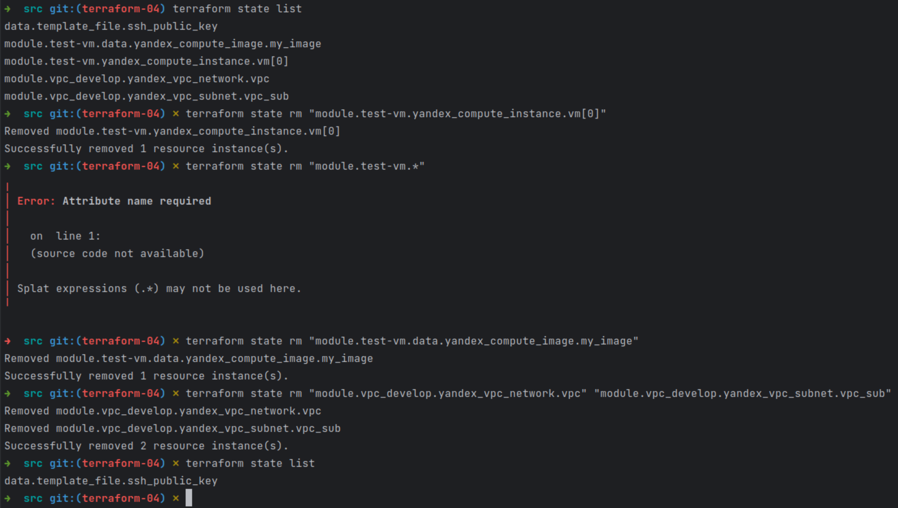
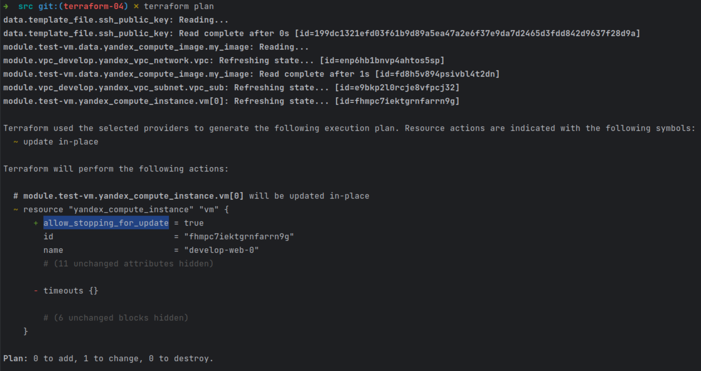

### Задание 1  
Создать 1 ВМ используя модуль. В файле [cloud-init.yml](src/cloud-init.yml) использованы переменные для ssh ключа и имени пользователя, ключ передан функцией template_file в файле [data.tf](src/data.tf)  
Также в файл добавлена установка nginx и открыт порт ssh.  
Консоль подключилась, nginx установлен:  
  

### Задание 2  
Написан локальный модуль [vpc-local](src/vpc-local) создающий 2 ресурса: сеть и подсеть в зоне, объявленной при вызове модуля.  
Переменные с названием сети (env_name), zone (default_zone) и v4_cidr_blocks (default_cidr) указаны в [variables.tf](src/variables.tf) и переданы в модуль.  
Модуль возвращает необходимую информацию о созданных ресурсах через [outputs.tf](src/vpc-local/outputs.tf). Вот скриншот информации о модуле:  
  
Ресурсы yandex_vpc_network и yandex_vpc_subnet [заменены](src/main.tf) созданным модулем. Там же из нового модуля переданы необходимые параметры ВМ.  
[Документация к модулю](src/vpc-local/README.md) сгенерирована при помощи terraform-docs.  

### Задание 3  
1. Вывести список ресурсов в стейте:  
  
2. Полностью удаляю из стейта модуль vpc командой  
terraform state rm "module.vpc_develop.yandex_vpc_network.vpc" "module.vpc_develop.yandex_vpc_subnet.vpc_sub"  
3. Полностью удаляю из стейта модуль vm командой  
terraform state rm "module.test-vm.data.yandex_compute_image.my_image" "module.test-vm.yandex_compute_instance.vm[0]"  
Поэкспериментировал с подстановочными знаками в именах ресурсов - не работают:  
  
4. Импортирую всё обратно. Листинг в файле [terraform_import_state.txt](src/terraform_import_state.txt). Deprecation warnings удалены.   
Проверяю terraform plan. Почему-то после импорта атрибут allow_stopping_for_update изменился на null:  
  
Изучил бекапы terraform.tfstate, заметил что атрибут изменился после импорта.  
Изучил доступные фактически атрибуты ресурса в выводе команды  
[yc compute instance get --id fhmpc7iektgrnfarrn9g](img/tf4-t3-4_1.png)  
Если я правильно понимаю процесс, yandex cloud этот атрибут не возвращает и при импорте он сбрасывается. Насколько допустимо будет просто переписать его в файле terraform.tfstate?  
