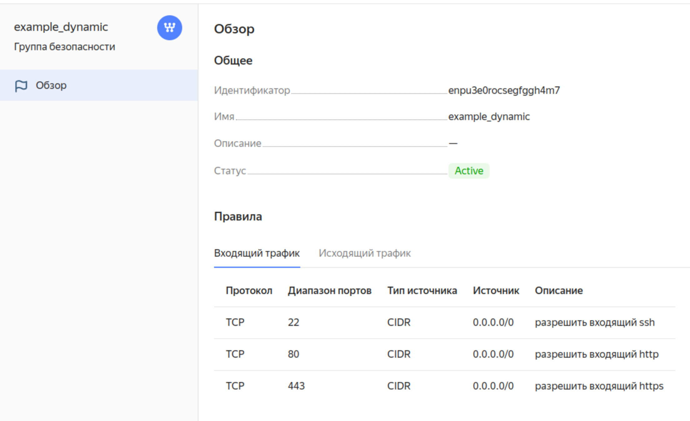
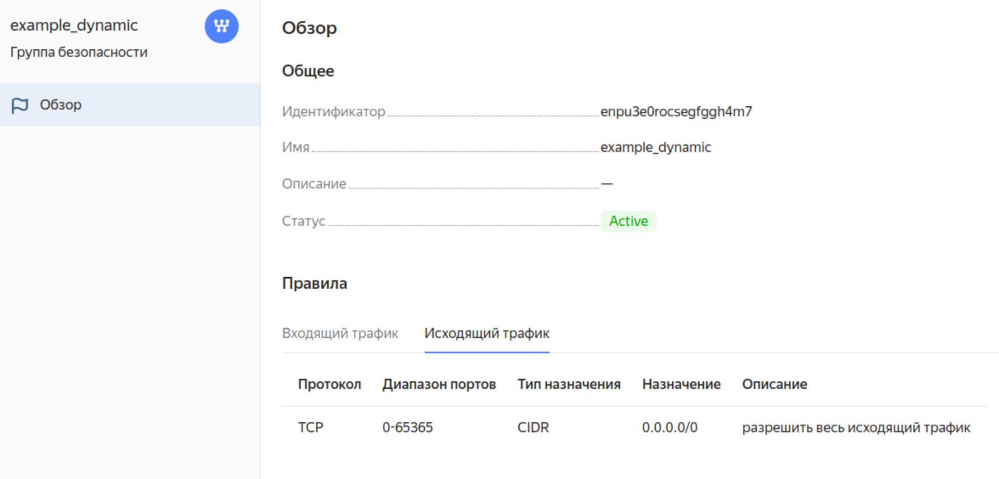
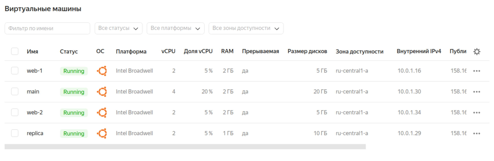
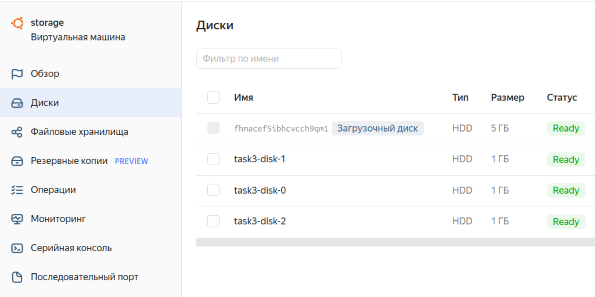
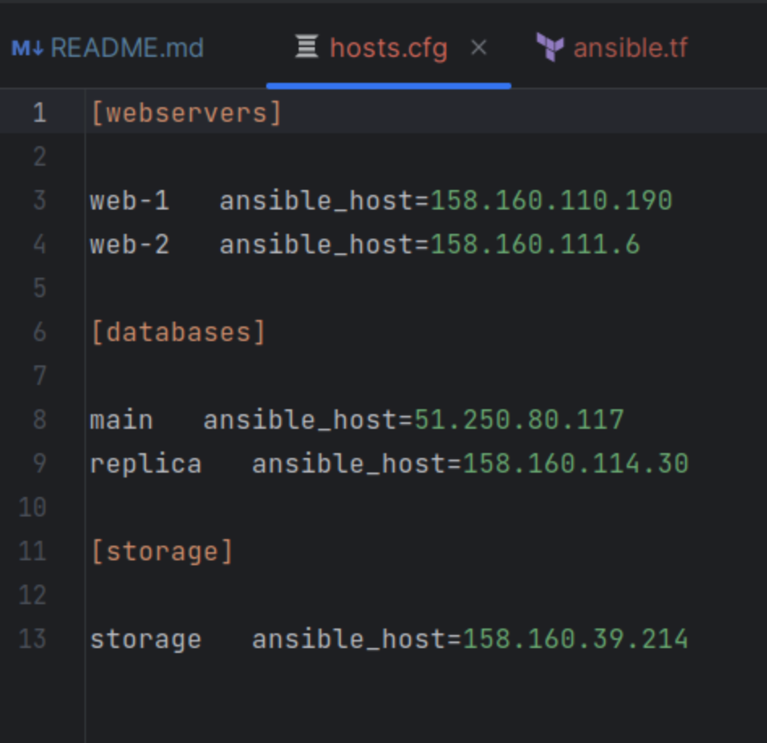
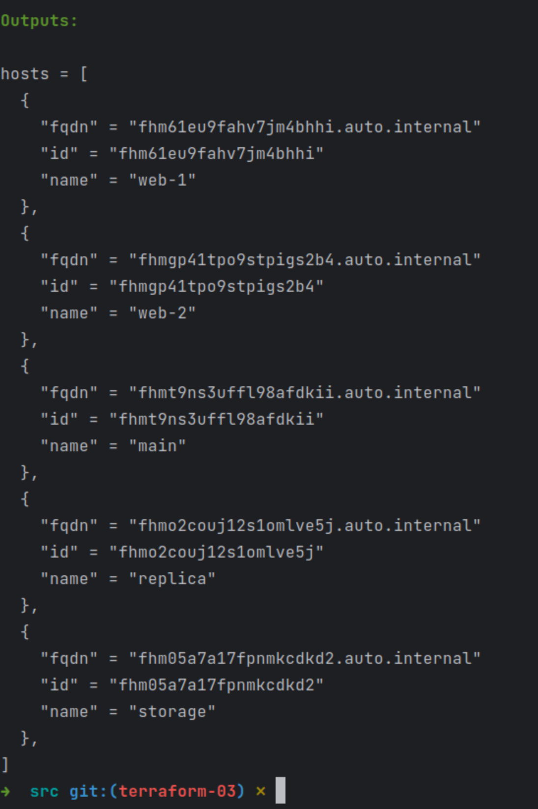

### Задание 1  
Проект инициализирован, выполнен, вот скриншот созданных правил Групп безопасности:  
  
  

### Задание 2  
#### 1  
Создан файл [count-vm.tf](src/count-vm.tf) создающий две одинаковые машины с именами web-1 и web-2, назначена сделанная в первом задании группа безопасности.  
#### 2  
В файле [for_each-vm.tf](src/for_each-vm.tf) описано создание еще двух разных ВМ с именами main и replica используя мета-аргумент for_each loop. Общая переменная - vm_for_resources в файле [variables.tf](src/variables.tf)  
#### 3  
ВМ из пункта 2.2 будут создаваться после ВМ из 2.1 благодаря мета-аргументу depends_on  
#### 4  
В файл [locals.tf](src/locals.tf) добавлена функция считывающая публичную часть ключа из ~/.ssh/id_ed25519.pub  
#### 5  
Проект инициализирован, код выполнен:  
  

### Задание 3  
Три одинаковых диска и ВМ с ними созданы в файле [disk_vm.tf](src/disk_vm.tf)  
Машина создана  
  

### Задание 4  
В файле [ansible.tf](src/ansible.tf) создал inventory-файл для ansible. IP отличаются от вывода предыдущих заданий, т.к. делались в разное время.  
На выходе получен [hosts.cfg](src/hosts.cfg) и его скриншот:  

### Задание 5  
Далеко не сразу, но написал [output](src/output.tf) отображающий все 5 созданных ВМ в виде списка словарей:  

