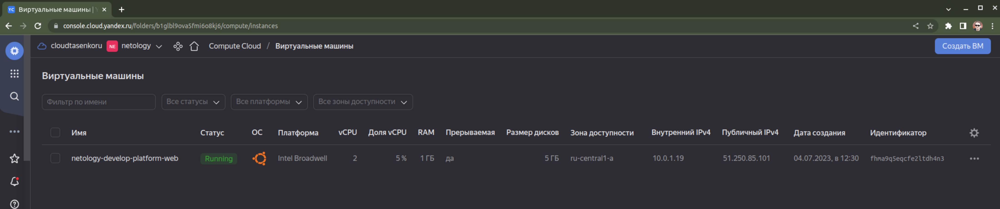
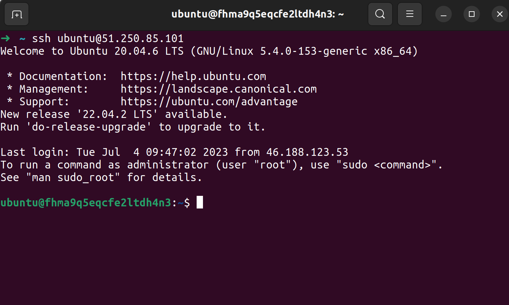
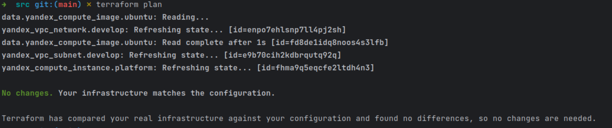
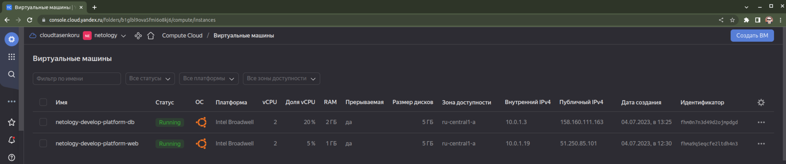
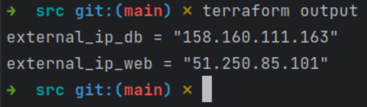

## Задание 1  
### Ошибки:  
main.tf
resource "yandex_compute_instance" "platform"
- platform_id = "standart-v4"  
У Yandex Cloud доступно всего 3 стандартных платформы и слово standart пишется как standard. Исправляю на standard-v1.  
- cores = 1  
Минимально допустимое количество ядер - 2.  

### Значение параметров:  
- preemptible = true  
Делает виртуальную машину "прерываемой". Такая ВМ дешевле стоит, а кроме того, автоматически остановится спустя 24 часа работы или может быть принудительно выключена в случае нехватки ресурсов в той же зоне доступности.  
- core_fraction=5  
Задает минимальный гарантированный уровень производительности используемых ядер CPU. При значении 5 ВМ будет иметь доступ к физическим ядрам как минимум 5% времени. Подходит для нетребовательных к ресурсам и задержкам ВМ. Всё что меньше 100 стоит дешевле.  

### Пруфы Terraform.  

## Задание 2  

## Задание 3  

### Задание 4  

### Задание 5  
Выполнено.

### Задание 6  
Далеко не сразу, но получилось.  
