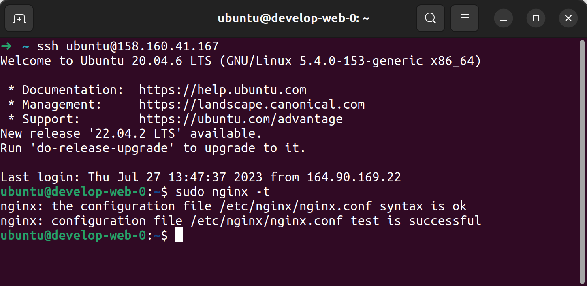
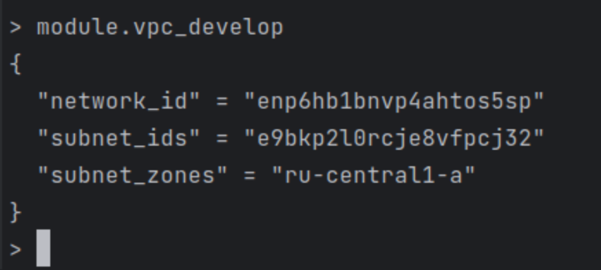

### Задание 1  
Создать 1 ВМ используя модуль. В файле [cloud-init.yml](src/cloud-init.yml) использованы переменные для ssh ключа и имени пользователя, ключ передан функцией template_file в файле [data.tf](src/data.tf)  
Также в файл добавлена установка nginx и открыт порт ssh.  
Консоль подключилась, nginx установлен:  
  

### Задание 2  
Написан локальный модуль [vpc-local](src/vpc-local) создающий 2 ресурса: сеть и подсеть в зоне, объявленной при вызове модуля.  
Переменные с названием сети (env_name), zone (default_zone) и v4_cidr_blocks (default_cidr) указаны в [variables.tf](src/variables.tf) и переданы в модуль.  
Модуль возвращает необходимую информацию о созданных ресурсах через [outputs.tf](src/vpc-local/outputs.tf). Вот скриншот информации о модуле:  
  
Ресурсы yandex_vpc_network и yandex_vpc_subnet [заменены](src/main.tf) созданным модулем. Там же из нового модуля переданы необходимые параметры ВМ.  
[Документация к модулю](src/vpc-local/README.md) сгенерирована при помощи terraform-docs.  
