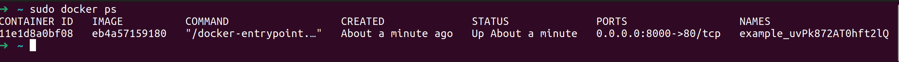
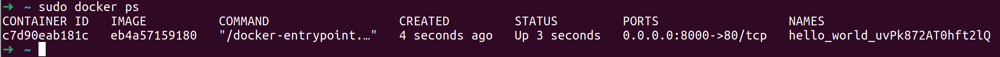
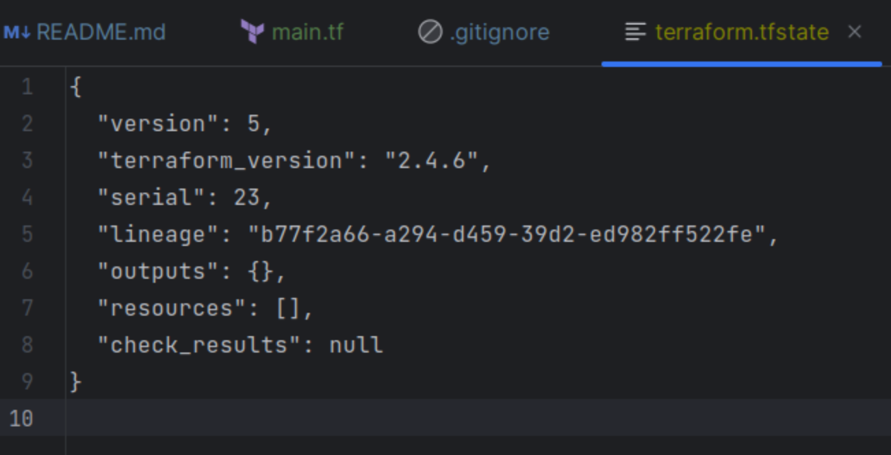
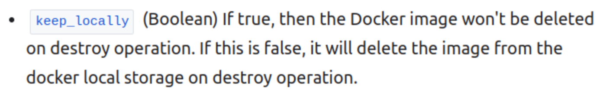
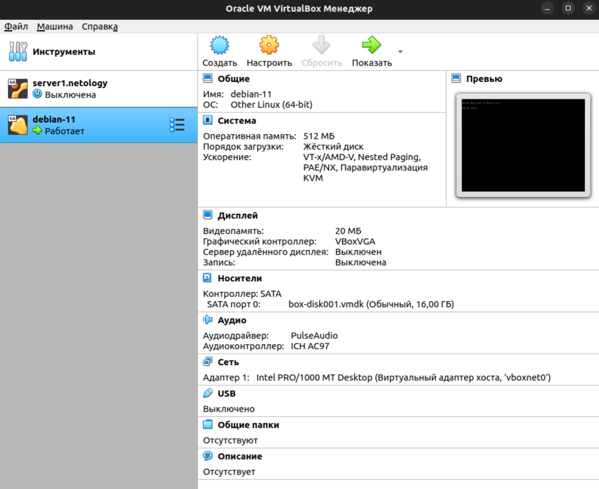

## Задание 1
### Изучил .gitignore  
Личную, секретную информацию следует сохранять в файле personal.auto.tfvars  

### Выполнил код проекта, содержимое ресурса random_password получилось следующим:  
"result": "uvPk872AT0hft2lQ"

### Ошибки в main.tf:  
- resource "docker_image" не хватает второго label, пишем "nginx"  
- resource "docker_container" опечатка в том же втором ярлыке, правим на "nginx"  
- атрибут name здесь же приводим в соответствие с ресурсом "random_password"  

### Выполняю код "sudo terraform apply"  
  

### Меняю имя контейнера на hello-world, запускаю с -auto-approve:  
Опасность использования ключа -auto-approve может быть в том что terraform не запрашивает подтверждения и в процессе выполнения могут быть удалены какие-то ценные ресурсы.  
  

### Уничтожаю всё!  
  

### Образ nginx:latest не был удален по причине наличия ключа keep_locally = true

## Задание 2*
[terraform plan](01/VB/tf-plan.txt)

